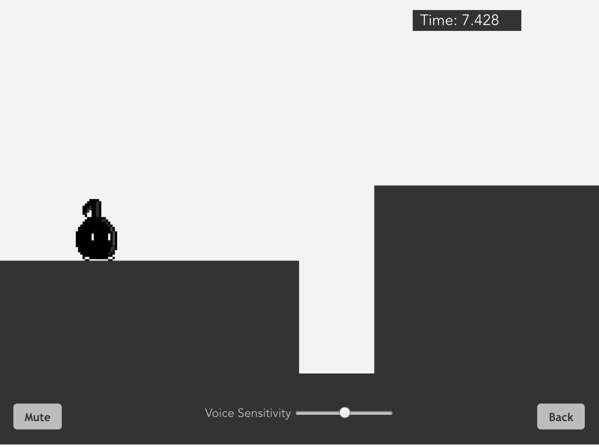

## Quaver
[Live]: https://yiyi1026.github.io/quaver/
### Background

Quaver is a voice control game, inspired by Yasuhati developed by Freem Inc.The user controls an quaver to avoid obstacles with voice. You may want to check the video here [here](https://www.youtube.com/watch?v=Eq5_uVMMN-s) to get a better understanding.

### Functionality & MVP  

With this Quaver Game, users will be able to:

- [ ] Start and reset the game board.
- [ ] Adjust voice control sensitivity.
- [ ] Select stage to start.

In addition, this project will include:

- [ ] An Start page describing the rules of the game.
- [ ] A production Readme

### Wireframes

This app will consist of a single screen with game board, game controls, and nav links to the Github, my LinkedIn. Game controls will include Start, Pause, and Reset buttons.




### Architecture and Technologies

This project will be implemented with the following technologies:

- Vanilla JavaScript for overall structure and game logic,
- Web Audio API to translate microphone input into voice frequency data.
- `Vue.js` with `HTML5 Canvas` for DOM manipulation and rendering,
- Webpack to bundle and serve up the various scripts.

In addition to the webpack entry file, there will be three scripts involved in this project:

`main.vue`: this script will handle the logic for creating and updating the necessary `Vue.js` elements and rendering them to the DOM.

`quaver.vue`: this script will house the constructor and update functions for the `Quaver` object.  The `Quaver` object will contain methods for quaver to walk or jump.

`AudioAPI.js`: this script will handle the logic for voice control.  And It will use user microphone input as argument to control the quaver to jump or walk.

`StageData.js`: this script will handle the obstacles' data and positioning.

### Voice Control methods


```
export default {
  isSupport,
  start () {
    return new Promise((resolve, reject) => {
      navigator.getUserMedia({audio: true}, stream => {
        const source = context.createMediaStreamSource(stream);
        const analyser = context.createAnalyser();
        source.connect(analyser);
        analyser.fftSize = 2048;
        resolve(analyser);
      }, () => {
        reject()
      })
    })
  },
  getVoiceSize (analyser) {
    const dataArray = new Uint8Array(analyser.frequencyBinCount);
    analyser.getByteFrequencyData(dataArray);
    const data = dataArray.slice(100, 6000);
    const sum = data.reduce((a, b) => a + b);
    return sum;
  }
}
```


### Future features

There are many directions this voice control game could eventually go.  Some anticipated updates are:

- [ ] Add crotchet enemies.
