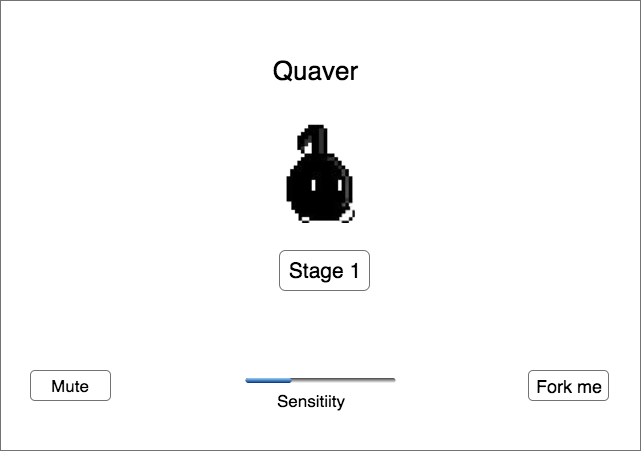
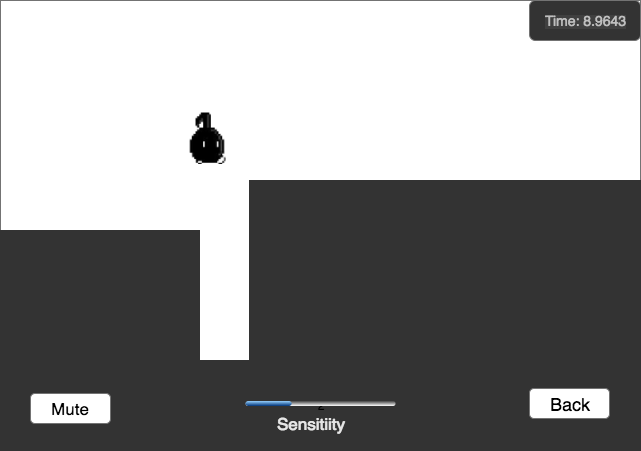

## Quaver

### Background

Quaver is a voice control game, inspired by Yasuhati developed by Freem Inc.The user controls an quaver to avoid obstacles with voice. You may want to check the video here [here](https://www.youtube.com/watch?v=Eq5_uVMMN-s) to get a better understanding.

The game rules are as follow:
1) User could use speaking voice, singing voice, or any other sound with similar frequency interval as human voice.
2) User uses smaller voice to make the quaver to walk, louder voice to jump and even louder for higher jump.
3) If user makes a voice when the quaver is jumping, it could move even forward.
4) User will lose the game if the quaver hits any enemy or falls off the cliff(edge).
5) User will win one stage if the quaver lands the destination(the red triangle)。User will win the entire game if the quaver completes all four stages.

### Functionality & MVP  

With this Quaver Game, users will be able to:

- [ ] Start, pause, and reset the game board.
- [ ] Select stage to start.

In addition, this project will include:

- [ ] An Demo modal describing the rules of the game.
- [ ] A production Readme

### Wireframes

This app will consist of a single screen with game board, game controls, and nav links to the Github, my LinkedIn. Game controls will include Start, Pause, and Reset buttons.

### Architecture and Technologies

This project will be implemented with the following technologies:

- Vanilla JavaScript for overall structure and game logic,
- `Vue.js` with `HTML5 Canvas` for DOM manipulation and rendering,
- Web Audio API to translate microphone input into data.
- Webpack to bundle and serve up the various scripts.

In addition to the webpack entry file, there will be three scripts involved in this project:

`board.vue`: this script will handle the logic for creating and updating the necessary `Vue.js` elements and rendering them to the DOM.

`quaver.vue`: this script will house the constructor and update functions for the `Quaver` object.  The `Quaver` object will contain methods for quaver to walk or jump.

`voice.js`: this script will handle the logic for voice control.  And It will use user microphone input as argument to control the quaver to jump or walk.

`obstacle.vue`: this script will handle the obstacles' data and positioning.

### Implementation Timeline

**Day 1**: Setup all necessary Node modules, including getting webpack up and running and `Vue.js` installed.  Create `webpack.config.js` as well as `package.json`.  Write a basic entry file and the bare bones of all 3 scripts outlined above.  Learn the basics of `Vue.js`.  Goals for the day:

- Get a green bundle with `webpack`
- Learn enough `Vue.js` to render an object to the `Canvas` element

**Day 2**: Dedicate this day to learning the `Vue.js` API.  First, build out the `Quaver` object to connect to the `Board` object.  Then, use `board.vue` to create and render the `Quaver` object.  Build in the ability to make quaver look moving if key is pressed(testing only).  Goals for the day:

- Complete the `quaver.vue` module (constructor, update functions)
- Render quaver to the `Canvas` using `Vue.js`
- the quaver could make walk or jump movement according to different keys(test only).

**Day 3**: Build out the `Obstacle` object to connect to the `Board` object.  Then, use `board.vue` to create and render the `Obstacle` objects.  Goals for the day:

- Complete the `Obstacle.vue` module (constructor, update functions)

**Day 4**: Install the controls for the user to interact with the game.  Style the frontend, making it polished and professional.  Goals for the day:

- Create controls for game stage choice, reset.
- Have a styled `Canvas`, nice looking controls and title
- If time: include bar on the bottom to adjust sensitivity of microphone.

### Bonus features

There are many directions this quaverular automata engine could eventually go.  Some anticipated updates are:

- [ ] quaver could do parabolic jump.
- [ ] Slider to control microphone sensitivity.
- [ ] Add crotchet enemies.
